# 🏗️ Architecture Diagrams (Mermaid)

## 📊 Overview

This document contains all architecture diagrams in **Mermaid format** for the AI Voice Retention Agent application. These diagrams can be rendered in GitHub, GitLab, Notion, and many other platforms.

---

## 📋 Table of Contents

1. [High-Level System Architecture](#1-high-level-system-architecture)
2. [Component Architecture](#2-component-architecture)
3. [Data Flow - Customer Selection](#3-data-flow---customer-selection)
4. [Data Flow - Call Start](#4-data-flow---call-start)
5. [Data Flow - Message Processing](#5-data-flow---message-processing)
6. [Data Flow - PIN Verification](#6-data-flow---pin-verification)
7. [Data Flow - Movers Retention](#7-data-flow---movers-retention)
8. [Database Schema](#8-database-schema)
9. [API Endpoints](#9-api-endpoints)
10. [Deployment Architecture](#10-deployment-architecture)
11. [Security Layers](#11-security-layers)

---

## 1. High-Level System Architecture


---

## 2. Component Architecture

### Frontend Components


### Backend Components

```mermaid
graph TB
    subgraph "Backend API Server - Port 3001"
        subgraph "API Routes Layer"
            CustomerRoute[/api/customer<br/>4 endpoints]
            ConvRoute[/api/conversation<br/>5 endpoints]
            TranscribeRoute[/api/transcribe<br/>1 endpoint]
            HealthRoute[/health<br/>1 endpoint]
        end
        
        subgraph "Services Layer"
            ConvMgr[Conversation Manager<br/>• Session Management<br/>• System Prompts<br/>• Message Processing]
            DBService[Database Service<br/>• MongoDB Connection<br/>• Retry Logic<br/>• Health Checks]
            AIService[Databricks Service<br/>• LLM Integration<br/>• Model Selection<br/>• Response Processing]
            SpeechFmt[Speech Formatter<br/>• Currency Formatting<br/>• Date Formatting<br/>• Symbol Replacement]
        end
        
        subgraph "Data Layer"
            CustomerModel[Customer Model<br/>Mongoose Schema]
            MockData[Mock Data<br/>5 Demo Customers]
            SeedGen[Seed Generator<br/>200+ Customers]
        end
    end
    
    CustomerRoute --> DBService
    CustomerRoute --> CustomerModel
    CustomerRoute --> MockData
    
    ConvRoute --> ConvMgr
    TranscribeRoute --> AIService
    
    ConvMgr --> AIService
    ConvMgr --> SpeechFmt
    ConvMgr --> DBService
    
    DBService --> CustomerModel
    DBService --> MockData
    
    SeedGen --> CustomerModel
    
    style CustomerRoute fill:#ffccbc
    style ConvRoute fill:#ffccbc
    style TranscribeRoute fill:#ffccbc
    style ConvMgr fill:#c5cae9
    style DBService fill:#c5cae9
    style AIService fill:#c5cae9
    style CustomerModel fill:#b2dfdb
    style MockData fill:#b2dfdb
```

---

## 3. Data Flow - Customer Selection


---

## 4. Data Flow - Call Start


---

## 5. Data Flow - Message Processing


---

## 6. Data Flow - PIN Verification


---

## 7. Data Flow - Movers Retention

```mermaid
flowchart TD
    Start([Customer mentions moving]) --> Detect[AI Detects keywords:<br/>moving, relocating, new address]
    
    Detect --> Empathy[Agent: Express empathy<br/>Moving is a big change!<br/>We might be able to help]
    
    Empathy --> AskAddress[Agent: Where are you moving to?<br/>What's the new address?]
    
    AskAddress --> UserAddress[User provides address]
    
    UserAddress --> Verify[Agent: Repeat address<br/>for confirmation]
    
    Verify --> Confirm{User confirms<br/>address?}
    
    Confirm -->|No| AskAddress
    Confirm -->|Yes| CheckState{Is state<br/>FL, TX, or CA?}
    
    CheckState -->|Yes - Serviced| GoodNews[Agent: Great news!<br/>We provide service<br/>in that state!]
    
    CheckState -->|No - Not Serviced| NotServed[Agent: Sorry, we don't<br/>serve that area.<br/>Let me help with<br/>cancellation]
    
    GoodNews --> Offer[Agent: Present Movers Offer<br/>• 1 Gig Fiber Internet<br/>• Special promotional pricing<br/>• Pro installation included]
    
    Offer --> Details[Agent: Share details<br/>• 1000 Mbps speeds<br/>• No early termination fees<br/>• Coordinate move schedule]
    
    Details --> Interest{Customer<br/>interested?}
    
    Interest -->|Yes| Schedule[Collect move date<br/>Schedule installation<br/>Transfer service]
    Interest -->|No| Address[Address concerns<br/>Emphasize convenience<br/>of same provider]
    
    Address --> Reoffer{Customer<br/>reconsiders?}
    Reoffer -->|Yes| Schedule
    Reoffer -->|No| NotServed
    
    Schedule --> Success[🎉 Customer Retained<br/>Service transferred]
    NotServed --> Cancelled[Process cancellation<br/>with empathy]
    
    style Start fill:#e8f5e9
    style GoodNews fill:#c8e6c9
    style Success fill:#81c784
    style NotServed fill:#ffcdd2
    style Cancelled fill:#ef9a9a
    style CheckState fill:#fff9c4
    style Interest fill:#fff9c4
```



---

## 8. Database Schema


---

## 9. API Endpoints


---

## 10. Deployment Architecture

### Development Environment

```mermaid
graph TB
    subgraph "Developer Machine - localhost"
        subgraph "Terminal 1"
            FE[Frontend Server<br/>Port 3000<br/>npm start]
        end
        
        subgraph "Terminal 2"
            BE[Backend API<br/>Port 3001<br/>npm start]
        end
        
        subgraph "Local Services"
            DB[(MongoDB<br/>Port 27017<br/>Local instance)]
        end
        
        subgraph "Environment"
            ENV[.env File<br/>• API Keys<br/>• DB URI<br/>• Config]
        end
    end
    
    subgraph "External"
        DBAPI[Databricks API<br/>Claude, GPT, Gemini<br/>Whisper STT]
    end
    
    FE -->|HTTP| BE
    BE --> DB
    BE --> ENV
    BE -->|HTTPS| DBAPI
    
    style FE fill:#e3f2fd
    style BE fill:#e8f5e9
    style DB fill:#f3e5f5
    style DBAPI fill:#fff3e0
```



### Production Architecture (Proposed)

```mermaid
graph TB
    subgraph "Cloud Infrastructure"
        LB[Load Balancer<br/>AWS ALB]
        
        subgraph "Frontend Tier"
            FE1[Frontend Instance 1<br/>S3 + CloudFront]
            FE2[Frontend Instance 2<br/>S3 + CloudFront]
        end
        
        subgraph "API Gateway"
            GW[API Gateway<br/>Rate Limiting<br/>Auth]
        end
        
        subgraph "Backend Tier"
            BE1[Backend API 1<br/>EC2/ECS]
            BE2[Backend API 2<br/>EC2/ECS]
            BE3[Backend API 3<br/>EC2/ECS]
        end
        
        subgraph "Session Store"
            Redis[(Redis<br/>Shared Sessions)]
        end
        
        subgraph "Database Tier"
            Primary[(MongoDB Primary<br/>Atlas)]
            Secondary1[(MongoDB Secondary<br/>Replica 1)]
            Secondary2[(MongoDB Secondary<br/>Replica 2)]
        end
    end
    
    subgraph "External Services"
        DBAI[Databricks<br/>Foundation Models]
        DBSTT[Databricks<br/>Whisper STT]
    end
    
    Users[Users] --> LB
    LB --> FE1
    LB --> FE2
    
    FE1 --> GW
    FE2 --> GW
    
    GW --> BE1
    GW --> BE2
    GW --> BE3
    
    BE1 --> Redis
    BE2 --> Redis
    BE3 --> Redis
    
    BE1 --> Primary
    BE2 --> Primary
    BE3 --> Primary
    
    Primary --> Secondary1
    Primary --> Secondary2
    
    BE1 --> DBAI
    BE2 --> DBAI
    BE3 --> DBAI
    
    BE1 --> DBSTT
    BE2 --> DBSTT
    BE3 --> DBSTT
    
    style LB fill:#ffccbc
    style GW fill:#ffccbc
    style FE1 fill:#e3f2fd
    style FE2 fill:#e3f2fd
    style BE1 fill:#e8f5e9
    style BE2 fill:#e8f5e9
    style BE3 fill:#e8f5e9
    style Redis fill:#ffe0b2
    style Primary fill:#f3e5f5
    style Secondary1 fill:#f3e5f5
    style Secondary2 fill:#f3e5f5
```



---

## 11. Security Layers


---

## 🎯 How to Use These Diagrams

### **In GitHub/GitLab**
Mermaid diagrams render automatically! Just paste them in:
- README files
- Wiki pages
- Issue descriptions
- Pull request descriptions

### **In Notion**
1. Add a code block
2. Select "Mermaid" as the language
3. Paste the diagram code

### **In Confluence**
1. Install "Mermaid for Confluence" plugin
2. Use the Mermaid macro
3. Paste the diagram code

### **Standalone Rendering**
Use online editors:
- https://mermaid.live/
- https://mermaid.ink/

---

## 📝 Diagram Syntax Reference

### **Graph Types**
- `graph TB` - Top to Bottom
- `graph LR` - Left to Right
- `flowchart TD` - Flowchart Top-Down
- `sequenceDiagram` - Sequence diagram
- `erDiagram` - Entity Relationship

### **Node Shapes**
- `[Rectangle]` - Rectangle
- `(Rounded)` - Rounded rectangle
- `([Stadium])` - Stadium shape
- `[[Subroutine]]` - Subroutine
- `[(Database)]` - Cylinder/Database
- `((Circle))` - Circle
- `{Diamond}` - Diamond/Decision

### **Arrows**
- `-->` - Solid arrow
- `-.->` - Dotted arrow
- `==>` - Thick arrow
- `-->>` - Async message

---

**Last Updated:** 2025-01-18  
**Version:** 1.0  
**Status:** ✅ Ready to Use

