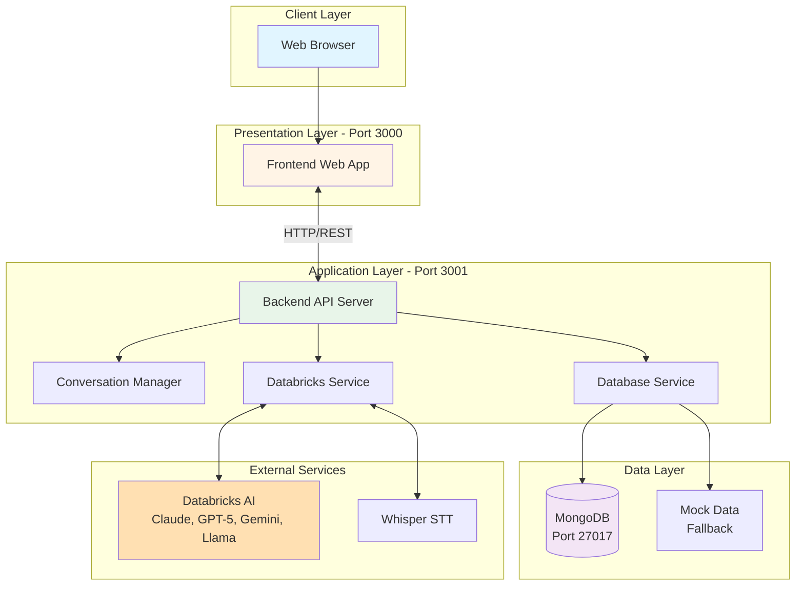
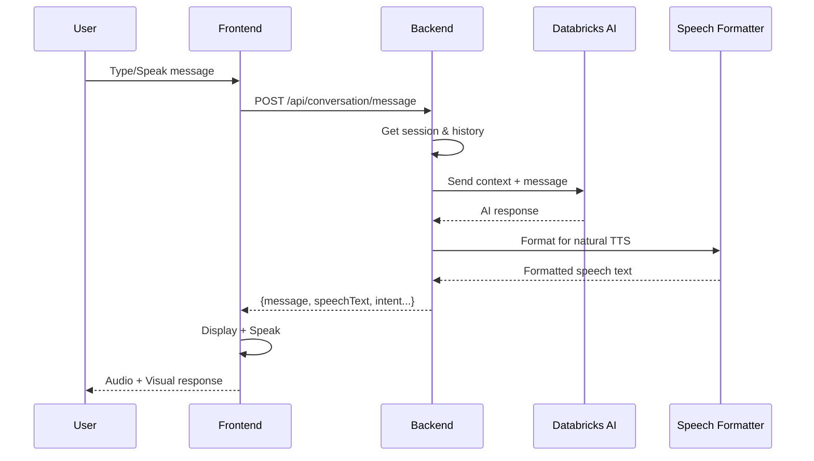
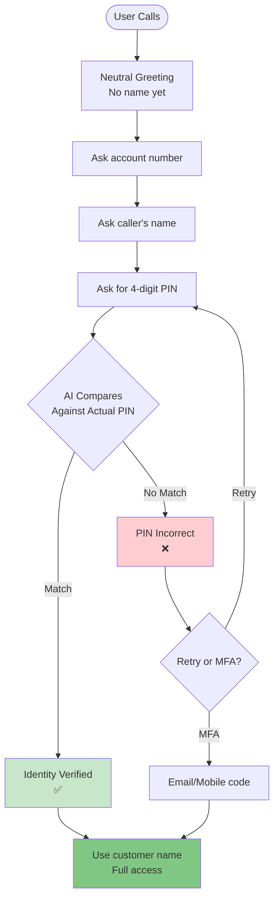
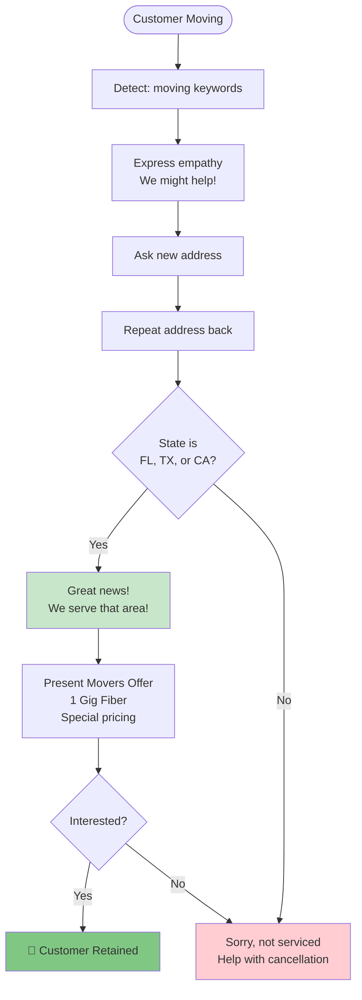
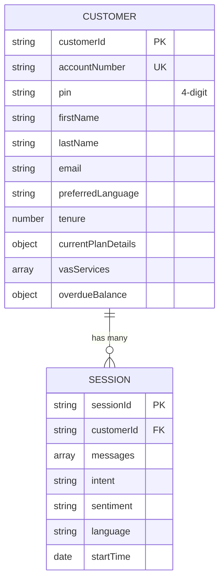
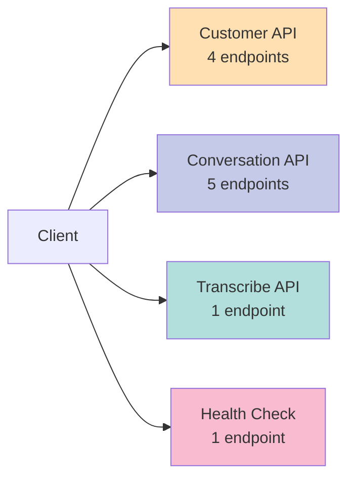
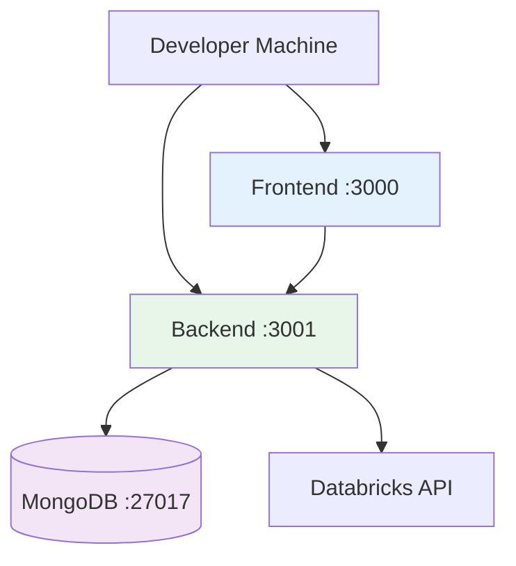
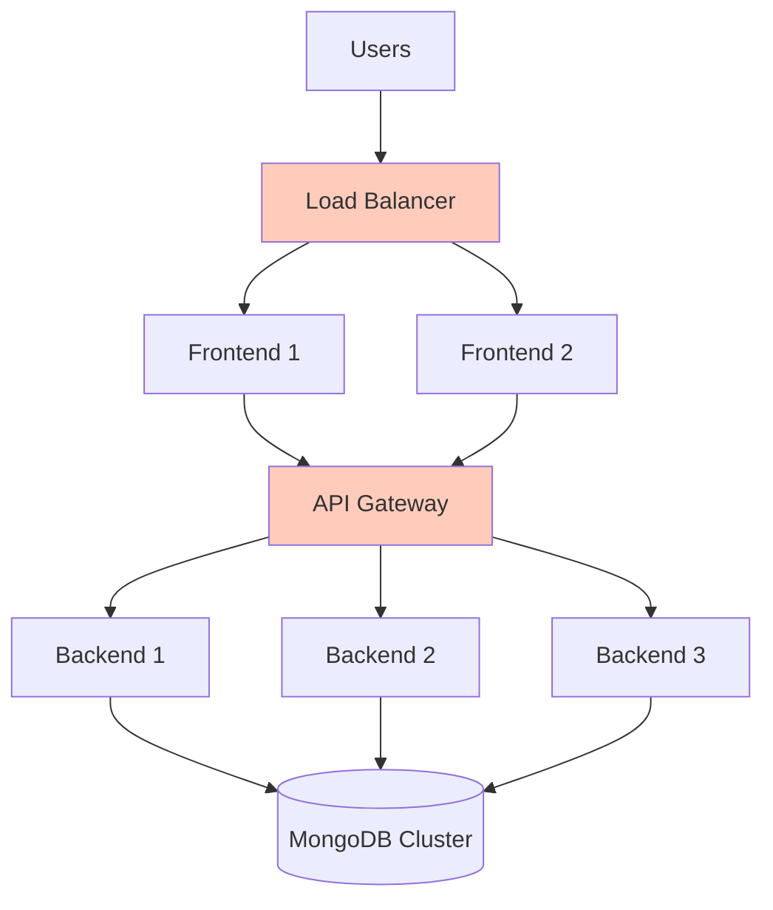
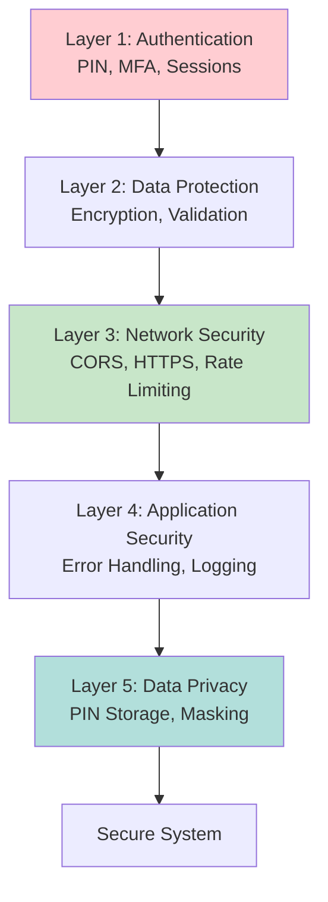

# Architecture Diagrams (Mermaid)

## 📊 Interactive Architecture Diagrams

This page contains **interactive Mermaid diagrams** that render automatically in GitHub, GitLab, and other platforms.

---

## 🏛️ High-Level System Architecture

---

## 🔄 Message Processing Flow

---

## 🔐 PIN Verification Flow

---

## 🏠 Movers Retention Flow

---

## 🗄️ Database Schema

---

## 🔌 API Endpoints

---

## 🚀 Deployment Architecture

### Development

### Production

---

## 🔐 Security Layers

---

## 📝 More Diagrams

For complete diagrams including component architecture, detailed data flows, and more:

**See:** [Complete Mermaid Diagrams](../ARCHITECTURE-MERMAID.md)

---

**Back to:** [Architecture Overview](Architecture-Overview) | [Home](Home)

